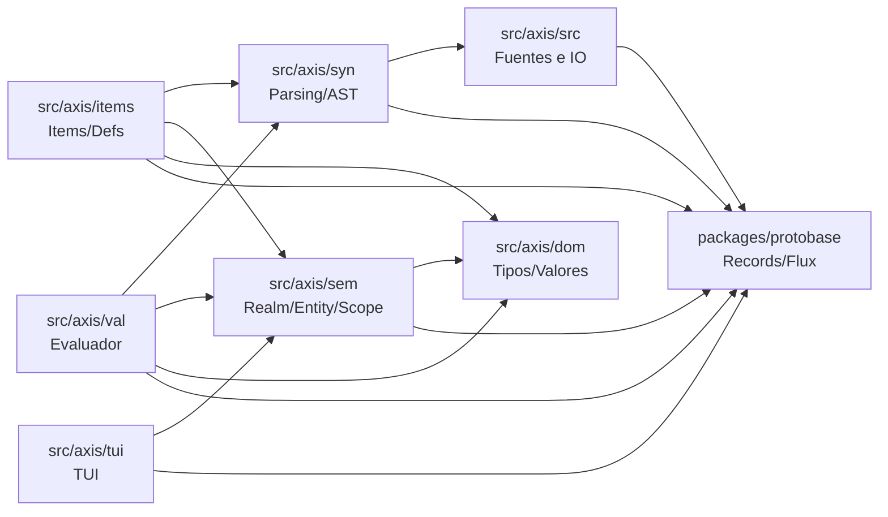

# Axis

Axis es un lenguaje/DSL experimental con pipeline incremental de parsing, AST,
semantica y evaluacion. El modelo se apoya en Protobase/Flux para mantener un
grafo inmutable y recomputar solo lo necesario ante cambios de entrada.

## Estado actual

- Parser, AST y semantica base implementados.
- Resolucion de nombres y entidades por anchor.
- Evaluador parcial con literales y operadores aritmeticos basicos.
- TUI opcional para inspeccion (Textual).
- Pendiente: `Apply`, `Index`, `Member` en evaluacion.

## Pipeline incremental (vista general)

```
Package -> Items -> Contexts -> Realm -> Entity
```

- `Package` agrega archivos `.ax` y construye items por archivo.
- Cada `Item` es un `Context` y emite contribuciones semanticas.
- `Realm` agrega contribuciones de todos los contextos y crea entidades por
  `anchor`.
- `Entity` agrupa contribuciones por forma (spec/overload) para resolucion.

## Requisitos

- Python 3.13+
- Poetry
- Antlr4 tools (via `antlr4-tools`)

Opcional (dev): `watchdog` para `--watch` y `textual` para `--tui`.

## Instalacion

```bash
poetry install
```

## Uso rapido

Comandos con `just`:

```bash
just help
just launch -- --help
just test
just test-all
just gen-parser
```

Comandos directos:

```bash
poetry run python -m axis --help
poetry run python -m axis --repl
poetry run python -m axis --watch
poetry run python -m axis --tui
poetry run python -m unittest discover -s tests
```

## Ejemplos de lenguaje

Archivos de ejemplo en `codebase/` (por ejemplo `codebase/sandbox` y
`codebase/std.core`).

## Estructura del repo

- `src/axis/`: codigo principal
  - `syn/`: gramatica ANTLR, parsing y AST
  - `items/`: items/defs que emiten contribuciones
  - `sem/`: realm/entity/scope
  - `dom/`: valores, tipos y estructuras
  - `val/`: evaluador
  - `src/`: fuentes, IO y watchers
  - `tui/`: interfaz textual
- `packages/protobase/`: runtime de records inmutables, consing y flux
- `tests/`: suite unittest

Dependencias entre capas (A -> B significa "A depende de B"):



## Documentacion interna

- Guia de estilo y patrones de protobase/flux: `docs/style_guide.md`
- Informe de auditoria del proyecto: `docs/audit.md`

## Notas

- El generador de parser usa `just gen-parser` con `Axis.g4`.
- `just docs` genera la documentacion Sphinx en `dist/docs`.
