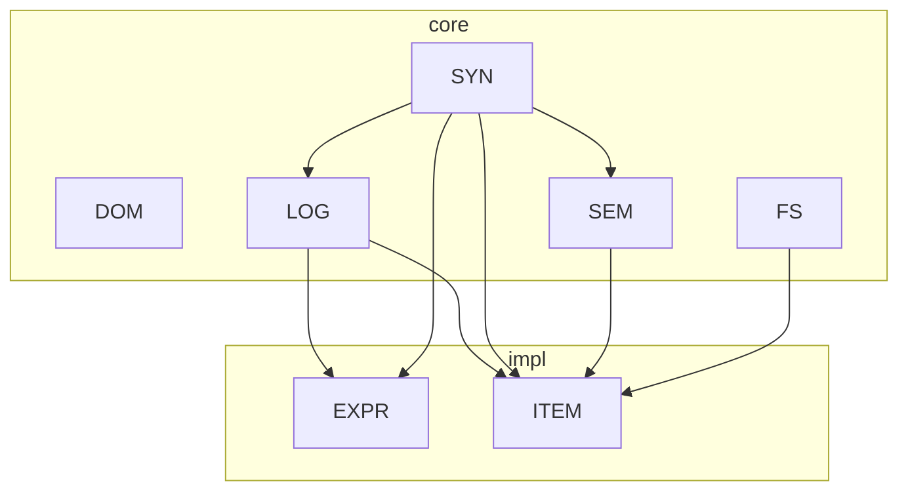

# AXIS

Axis es un lenguaje en diseño cuyo núcleo unifica AST, sistema semántico y un
modelo de datos canónico. El flujo general separa estrictamente:

- `Meta` (descriptores estructurales) y `Data` (datos primitivos serializables),
- `Val` como único contenedor de valores (`Const` y `Var`) en todas las fases,
- entidades lógicas como base para tipos, sobrecargas y consultas.

## Documentación principal

- `docs/data-model.md`: modelo de datos (`Val`, `Type`, `Ref`) y codificación canónica
- `docs/entity.md`: sistema de entidades y resolución de sobrecargas
- `docs/logic-design.md`: capa lógica (facts, rules, queries)

## Arquitectura (src/axis)

- `src/axis/syn/`: AST, builder, outline y gramática ANTLR
- `src/axis/expr/`: nodos de expresión + matcher/reifier
- `src/axis/items/`: items, bloques y parsing de unidades
- `src/axis/sem/`: base de datos semántica y shapes
- `src/axis/dom/`: DOM canónico (Tuple/Index/Shape, Type, Ref, Val)
- `src/axis/src/`: utilidades de archivo/span
- `src/axis/log/`: diagnósticos

## Flujo conceptual

1. Parseo a AST (`syn`, `expr`, `items`).
2. Normalización a DOM canónico (`dom`), con `Val` y `Type`.
3. Construcción semántica (`sem`) a partir de contribuciones de items.
4. Resolución: overloads, constraints y consultas lógicas.

## Notas de build

- La gramática y los generados viven en `src/axis/syn/grammar/`.
- Para regenerar el parser: `just gen-parser`.
- `protobase` es interno y vive en `packages/protobase/src/protobase`.
