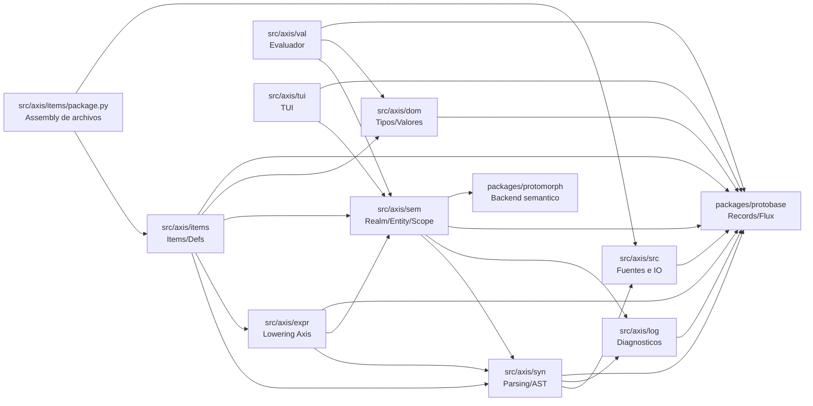

# Axis

Axis es un lenguaje/DSL experimental con pipeline incremental de parsing, AST,
semantica y evaluacion. El modelo se apoya en Protobase/Flux para mantener un
grafo inmutable y recomputar solo lo necesario ante cambios de entrada.

## Estado actual

- Parser, AST y semantica base implementados.
- Resolucion de nombres y entidades por anchor.
- Evaluador parcial con literales y operadores aritmeticos basicos.
- TUI opcional para inspeccion (Textual).
- Pendiente: `Apply`, `Index`, `Member` en evaluacion.

## Pipeline incremental (vista general)

```
Package -> Items -> Contexts -> Realm -> Entity
```

- `Package` agrega archivos `.ax` y construye items por archivo.
- Cada `Item` es un `Context` y emite contribuciones semanticas.
- `Realm` agrega contribuciones de todos los contextos y crea entidades por
  `anchor`.
- `Entity` agrupa contribuciones por forma (spec/overload) para resolucion.

## Requisitos

- Python 3.13+
- Poetry
- Antlr4 tools (via `antlr4-tools`)

Opcional (dev): `watchdog` para `--watch` y `textual` para `--tui`.

## Instalacion

```bash
poetry install
```

## Uso rapido

Comandos con `just`:

```bash
just help
just launch -- --help
just test
just test-all
just gen-parser
```

Comandos directos:

```bash
poetry run python -m axis --help
poetry run python -m axis --repl
poetry run python -m axis --watch
poetry run python -m axis --tui
poetry run python -m unittest discover -s tests
```

## Ejemplos de lenguaje

Archivos de ejemplo en `codebase/` (por ejemplo `codebase/sandbox` y
`codebase/std-core`).

## Estructura del repo

- `src/axis/`: codigo principal
  - `src/`: fuentes, IO y watchers
  - `log/`: diagnosticos y reportes
  - `syn/`: gramatica ANTLR, parsing y AST
  - `sem/`: realm/entity/scope y estructuras semanticas canonicas
  - `dom/`: valores, tipos y estructuras
  - `expr/`: lowering y helpers Axis-especificos sobre el AST
  - `items/`: items/defs que emiten contribuciones
  - `items/package.py`: ensamblado de archivos Axis en items/contextos
  - `val/`: evaluador
  - `tui/`: interfaz textual
- `packages/protobase/`: runtime de records inmutables, consing y flux
- `packages/protomorph/`: runtime y bridge semantico nominal/estructural
- `tests/`: suite unittest

## Sistema de capas

### Infra

- `packages/protobase/`
- `packages/protomorph/`

Proveen records/consing/flux y el backend semantico. No dependen de Axis.

### Framework

- `src/axis/src/`
- `src/axis/log/`
- `src/axis/syn/`
- `src/axis/sem/`
- `src/axis/dom/`

Representan la capa abstracta de un lenguaje sobre Axis: fuentes, parsing,
diagnosticos, grafo semantico, scopes, entidades y modelo de tipos/valores.

### Implementacion Axis

- `src/axis/expr/`
- `src/axis/items/`
- `src/axis/items/package.py`

Implementan la sintaxis declarativa propia de Axis y su lowering a la capa de
framework. Nuevos items, lowers o tipos de archivo deben vivir aqui sin exigir
cambios estructurales en `sem`.

### Consumidores

- `src/axis/val/`
- `src/axis/tui/`

Consumen framework e implementacion para evaluacion, inspeccion o UI.

## Regla de dependencias

- Infra no depende de Axis.
- Framework puede depender de infra y de otros modulos framework.
- Framework no debe depender de la implementacion concreta de Axis.
- Implementacion Axis puede depender de framework e infra.
- Consumidores pueden depender de framework e implementacion.

En particular, las estructuras semanticas canonicas consumidas por `Entity`
deben vivir en `src/axis/sem/`. Por eso `Binding`, `BindingStruct` y
`BindingShape` pertenecen a `sem`, y `expr` solo los construye/loweriza.

Politica de lowering:

- `syn` define los contratos abstractos que el framework puede consumir:
  - `syn.SymLike`
  - `syn.ScopeLike`
  - `syn.Expr.to_bound(scope)`
  - `syn.Expr.to_anchor(scope_ref)`
- `sem` posee las estructuras y runtime semantico concretos:
  - `sem.Scope`
  - `sem.Binding`
  - `sem.BindingStruct`
  - fachadas `sem.build_bound(...)` y `sem.build_default(...)`
- `expr` implementa el lowering Axis-especifico de esos contratos sobre nodos
  concretos (`Sym`, `Member`, `Index`, `Tuple`, etc.).
- `items` usa esos contratos para construir anchors, scopes y contribuciones.
- `sem` no debe depender de `expr`; consume lowering a traves de contratos de
  `syn` y tipos canonicos propios.

Dependencias objetivo entre capas (A -> B significa "A depende de B"):



Estado actual:

- Esta es la direccion de dependencias deseada.
- El modelo de bindings ya sigue esta regla: vive en `src/axis/sem/binding.py`
  y `src/axis/expr/ir/binding.py` solo lo construye.
- `Scope` ya vive en `src/axis/sem/scope.py`.
- El lowering de bounds y anchors ya sigue el contrato:
  - `syn` define `to_bound(...)` / `to_anchor(...)`
  - `expr` lo implementa
  - `sem` lo consume
- Los modulos `src/axis/expr/ir/*.py` quedan como shims de compatibilidad y no
  como dueños de la semantica canonica.

## Documentacion interna

- Guia de estilo y patrones de protobase/flux: `docs/style_guide.md`
- Informe de auditoria del proyecto: `docs/audit.md`

## Notas

- El generador de parser usa `just gen-parser` con `Axis.g4`.
- `just docs` genera la documentacion Sphinx en `dist/docs`.
