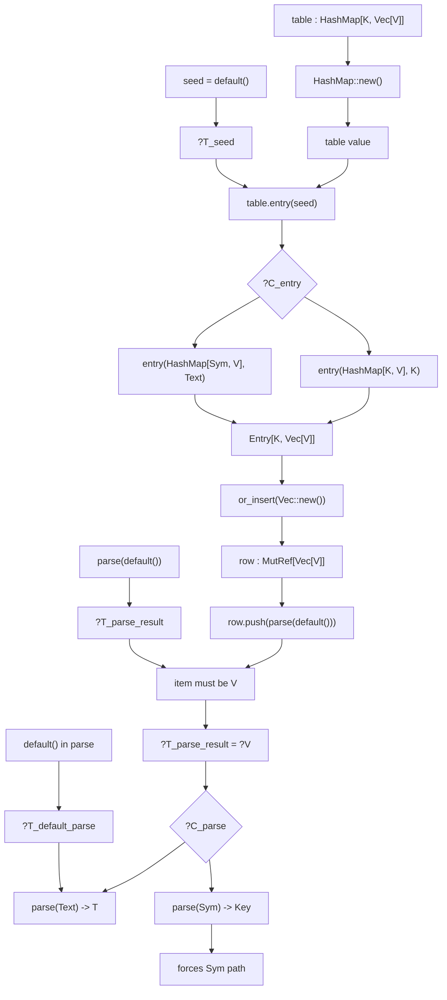

# Solver semantico regional

## Objetivo

Axis necesita un solver semantico regional, no solo validacion aislada de una
llamada.

El objetivo es poder resolver conjuntamente:

- inferencia de `SpecVar`
- seleccion de overloads
- propagacion desde tipos esperados
- defaults diferidos
- tipado de expresiones hermanas dentro de una misma region de codigo

Ejemplo objetivo:

```axis
let a = default()
let b: HashMap[K, V] = HashMap::new()
return b.set(default(), a)
```

Aqui `K` y `V` no se deciden en un solo punto. El tipo esperado de `b`, la
construccion de `HashMap::new()`, la llamada a `set`, y los dos `default()`
deben resolverse como un unico problema de constraints compartidas.

## Ejemplo objetivo mas desafiante

Un objetivo mas representativo para el solver regional es una region donde varias
llamadas y varios overloads se restringen mutuamente.

Sintaxis Axis-like:

```axis
let seed = default()
let table: HashMap[K, Vec[V]] = HashMap::new()

let row = table.entry(seed).or_insert(Vec::new())
row.push(parse(default()))

return table
```

Una lectura rust-like equivalente seria:

```rust
let seed = Default::default();
let mut table: HashMap<K, Vec<V>> = HashMap::new();

let row = table.entry(seed).or_insert(Vec::new());
row.push(parse(Default::default()));

return table;
```

Este ejemplo desafia al solver por varios motivos a la vez:

- `HashMap::new()` no fija por si sola ni `K` ni `V`
- `seed = default()` tampoco fija por si solo su tipo
- `table.entry(seed)` necesita que `seed : K`
- `or_insert(Vec::new())` exige que el valor insertado sea `Vec[V]`
- `Vec::new()` no fija por si sola `V`
- `row.push(...)` revela que `row` debe ser una referencia o vista mutable de
  `Vec[V]`
- `parse(default())` introduce otra llamada generica y otro `default()` cuyo
  resultado final debe acabar siendo `V`

Ademas, hay sinergia real entre overloads. Imaginemos firmas como estas:

```axis
def HashMap.new[K, V]() -> HashMap[K, V]

def HashMap.entry[K, V](self, key)
takes:
    val self: HashMap[K, V]
    val key: K
-> Entry[K, V]

def Entry.or_insert[K, V](self, value)
takes:
    val self: Entry[K, V]
    val value: V
-> MutRef[V]

def Vec.new[T]() -> Vec[T]

def Vec.push[T](self, item)
takes:
    val self: MutRef[Vec[T]]
    val item: T
-> Unit

def parse[T](text)
where:
    val T: FromText
takes:
    val text: Text
-> T

def default[T]()
where:
    val T: Default
-> T
```

Y aun peor, imaginemos overloads competidores:

```axis
def parse[T](text: Text) -> T
where:
    val T: FromText

def parse(text: Sym) -> Key

def HashMap.entry[K, V](self: HashMap[K, V], key: K) -> Entry[K, V]
def HashMap.entry[V](self: HashMap[Sym, V], key: Text) -> Entry[Sym, V]
```

Entonces la region debe decidir todo esto conjuntamente:

- si `seed` debe permanecer como `K` generico o si el overload especializado de
  `entry(Text)` fuerza `K = Sym`
- si `parse(default())` usa el overload generico `parse[T](Text) -> T` o el
  especializado `parse(Sym) -> Key`
- si el `default()` interno debe ser `Text`, `Sym`, o algun otro tipo admisible
- si `V` queda fijado por `or_insert(Vec::new())`, por `row.push(...)`, por
  `parse(...)`, o por la combinacion de todas

La solucion correcta no sale de validar cada llamada por separado. El solver debe:

1. generar candidatas estructurales para cada llamada
2. compartir una sola familia de variables de inferencia entre todas ellas
3. propagar informacion desde unas candidatas a otras
4. descartar combinaciones incompatibles de overloads
5. retrasar defaults hasta que la region haya acumulado suficiente informacion

En otras palabras, la unidad real de decision no es la llamada individual, sino
la region entera.

## Grafo de constraints del ejemplo

El ejemplo anterior puede bajarse a un grafo regional aproximado como este.

### Variables de inferencia relevantes

- `?K`, `?V`: argumentos de especializacion de `HashMap[K, Vec[V]]`
- `?T_seed`: tipo de `seed = default()`
- `?T_row`: tipo de `row`
- `?T_default_parse`: tipo del `default()` usado dentro de `parse(...)`
- `?T_parse_result`: resultado de `parse(...)`
- `?C_entry`: candidata elegida para `table.entry(...)`
- `?C_parse`: candidata elegida para `parse(...)`

### Vista ASCII

```text
                      [annotation]
                 table : HashMap[?K, Vec[?V]]
                           |
                           v
                    HashMap::new()
                           |
                           v
                 table value = HashMap[?K, Vec[?V]]
                           |
                           |
         +-----------------+------------------+
         |                                    |
         v                                    v
 seed = default()                      table.entry(seed)
    |                                      |
    |                                      |
    v                                      v
 ?T_seed -----------------------------> key : ?K
    |                                      |
    +------------ unify -------------------+
                                           |
                              overload choice ?C_entry
                              /                       \
                             /                         \
                            v                           v
         entry<K,V>(HashMap[K,V], K)        entry<V>(HashMap[Sym,V], Text)
                    |                                   |
                    |                                   |
                    +--------- constrains --------------+
                                           |
                                           v
                                   result : Entry[?K, Vec[?V]]
                                           |
                                           v
                            or_insert(Vec::new()) : MutRef[Vec[?V]]
                                           |
                                           v
                                        row = ?T_row
                                           |
                                           v
                                   row.push(parse(default()))
                                           |
                  +------------------------+-----------------------+
                  |                                                |
                  v                                                v
          row : MutRef[Vec[?V]]                         parse(default()) : ?T_parse_result
                  |                                                |
                  |                                                |
                  +-------------- item must be ?V -----------------+
                                                                   |
                                                                   v
                                                    ?T_parse_result = ?V
                                                                   |
                                                                   v
                                                      overload choice ?C_parse
                                                      /                  \
                                                     /                    \
                                                    v                      v
                                         parse<T>(Text) -> T          parse(Sym) -> Key
                                              |                            |
                                              |                            |
                                              v                            v
                              default() : ?T_default_parse        default() : Sym
                                              |
                                              v
                                           Text input
```

La lectura importante es:

- `?K` y `?V` nacen en la anotacion de `table`
- `HashMap::new()` no fija nada, solo hereda esas variables
- `seed = default()` queda inicialmente suspendido como `?T_seed`
- `table.entry(seed)` fuerza relacion entre `?T_seed`, `?K` y la candidata `?C_entry`
- `or_insert(Vec::new())` fija que el valor interno del mapa es `Vec[?V]`
- `row.push(...)` obliga a que el item insertado sea precisamente `?V`
- `parse(default())` debe producir `?V`, y por tanto su overload y el tipo de su
  `default()` quedan acoplados al mismo `?V`

### Vista Mermaid



### Consecuencia para el solver

Este grafo muestra por que el solver no puede operar por llamada aislada:

- `entry(...)` no se decide completamente sin saber si `seed` termina siendo `K`
  o `Text`
- `parse(...)` no se decide completamente sin saber que valor necesita `push(...)`
- el `default()` de `seed` y el `default()` de `parse(...)` no pueden resolverse
  de forma eager
- el overload de `entry(...)` puede influir en `K`, y eso a su vez cambia el
  espacio viable para el `default()` inicial
- el overload de `parse(...)` puede influir en `V`, y eso cambia la coherencia de
  `Vec::new()`, `row`, y `push(...)`

El solver regional debe representar explicitamente este grafo, propagar
restricciones en ambas direcciones y descartar combinaciones de candidatas que
se vuelvan incompatibles al compartir una misma sustitucion.

## Principio de arquitectura

Hay dos capas distintas y complementarias.

### 1. Seleccion compilada de candidatos

`protomorph.MatchTree` sigue siendo el backend compilado para:

- poda estructural temprana
- discriminacion por shape, valores y firmas variadicas
- captura de entornos locales (`MatchEnv`)

`MatchTree` no es el solver final. Su trabajo es reducir el espacio de busqueda y
dejar candidatas semanticas plausibles.

### 2. Solving semantico compartido

Sobre las candidatas producidas por `MatchTree`, `axis.sem` necesita mantener un
estado de inferencia compartido para:

- acumular sustituciones
- resolver constraints en conjunto
- retrasar obligaciones que aun no son decidibles
- comprometer elecciones de overload/especializacion solo cuando la region tenga
  informacion suficiente

## Que problema resuelve

Una llamada del estilo:

```axis
def search[T](container, content)
where:
   val T: Type
takes:
   val container: List T
   val content: T
```

no debe resolverse como dos checks independientes:

- `container : List T`
- `content : T`

Si se comprueban por separado y cada constraint devuelve solo `bool`, se pierde
la informacion inferida en la primera y no se puede reutilizar en la segunda.

El solver regional debe permitir:

1. capturar informacion parcial desde `container`
2. convertir esa informacion en sustituciones compartidas para `T`
3. reutilizar la misma sustitucion al validar `content`
4. producir la especializacion inferida `search[T]`

## Estructuras de datos necesarias

El solver necesita una estructura de region, no solo un indice o un arbol.

La idea minima es esta:

### Variables de inferencia

Metavariables para cosas aun no decididas:

- argumentos de especializacion
- tipos de expresiones
- resultados de llamadas
- defaults pendientes

Ejemplos conceptuales:

- `?T`
- `?K`
- `?V`
- `?result_call_1`

### Sustitucion compartida

Una store de sustituciones reutilizable en toda la region.

Base reutilizable actual:

- `pm.Subst`

Debe crecer para soportar solving incremental y no solo resultados locales de
`unify(...)`.

### Constraints semanticas

Obligaciones sobre variables, valores y tipos.

Base reutilizable actual:

- `sem.Constraint`

Hoy `Constraint.satisfies(...)` responde localmente. El siguiente paso es que una
constraint pueda resolver contra una sustitucion compartida y devolver nuevas
sustituciones, no solo `bool`.

### Conjuntos de candidatas

Cada call site o decision de overload necesita un conjunto de candidatas vivas.

Base reutilizable actual:

- `Entity.search_overloads(...)`
- `OverloadIndex.search(...)`
- `MatchTree.search(...)`

Hoy ya podemos podar candidatas y filtrar por constraints locales. Falta elevar
eso a una representacion estable de candidata resuelta parcialmente.

### Worklist / obligaciones diferidas

No todas las constraints se pueden resolver en el primer momento. Algunas deben
quedar aplazadas hasta que otra expresion refine una variable.

Ejemplos:

- `default()` sin tipo esperado inmediato
- resultado de una llamada cuyo tipo se fija por el contexto exterior
- bounds que dependen de `SpecVar` todavia no inferidas

## Reuso de la infraestructura actual

El solver nuevo no empieza desde cero.

### Ya reutilizable

- `StructSchema`
- `MatchTree`
- `SpecIndex`
- `OverloadIndex`
- `pm.Subst`
- `pm.unify(...)`
- `pm.satisfies(...)`
- `sem.Constraint`
- `Entity.search_overloads(...)`

### Ya encaminado, pero insuficiente aun

- filtrado post-`MatchTree` por constraints
- `Constraint.target_type`
- `Claim.where_constraints`
- `Entity.result_constraint`
- `Entity.underlying_constraint`

### Aun faltante

- sustitucion compartida entre constraints de una misma candidata
- inferencia explicita de `SpecVar` desde argumentos
- propagacion desde expected-result types
- resolucion regional de defaults
- representacion estable de una candidata parcialmente resuelta

## Modelo de solucion propuesto

### Region

Una region agrupa las expresiones que deben resolverse conjuntamente. En una
primera iteracion, una region puede ser:

- una llamada con su contexto inmediato
- un bloque local con `let` y `return`
- el cuerpo relevante de una expresion compuesta

Estructura conceptual:

```text
InferRegion
  vars
  subst
  pending_constraints
  delayed_constraints
  candidate_sets
  diagnostics
```

### Candidate set

Cada sitio de llamada o decision semantica mantiene sus candidatas activas.

Cada candidata necesita, al menos:

- contribution objetivo
- entorno capturado por `MatchTree`
- sustitucion local/compartida actual
- especializacion parcial inferida
- constraints pendientes propias

### Constraint solving

La idea es movernos desde esto:

- `constraint.satisfies(value) -> bool`

hacia algo de este estilo conceptual:

- `constraint.solve(value, subst) -> subst*`

Esto permite:

- inferir informacion nueva
- combinarla con lo ya inferido
- reencolar otras constraints dependientes

## Flujo esperado

### Paso 1. Candidate generation

Para una llamada:

1. localizar la `Entity`
2. usar `SpecIndex` / `OverloadIndex` y `MatchTree` para obtener candidatas
3. capturar los `MatchEnv` iniciales desde la forma de los argumentos

### Paso 2. Constraint seeding

Cada candidata genera constraints sobre:

- parametros
- `SpecVar`
- resultado
- defaults diferidos
- expected result type

### Paso 3. Shared solving

La region resuelve todas las constraints sobre una sola store de sustituciones.

Aqui deben poder ocurrir cosas como:

- `container: List T` fija `T`
- luego `content: T` reutiliza ese mismo `T`
- el resultado esperado de una expresion fuerza una especializacion pendiente
- un `default()` se resuelve solo cuando ya existe suficiente contexto

### Paso 4. Commitment

Cuando una candidata queda unica y consistente:

- se materializa la especializacion inferida
- se fija el overload seleccionado
- se instancia el resultado bajo el entorno final

## Relacion con `protomorph`

El reparto esperado es:

### `protomorph`

- algebra local
- `Subst`
- `unify(...)`
- `satisfies(...)`
- compiled candidate selection con `MatchTree`

### `axis.sem`

- regiones de inferencia
- politicas de seleccion/ambiguedad
- defaults diferidos
- diagnosticos
- composicion entre varias expresiones y varias candidatas

## Primer alcance intencional

La primera version del solver regional no necesita resolver todo.

Debe cubrir primero:

- especializacion inferida desde argumentos de llamada
- reutilizacion de sustituciones entre constraints de un mismo overload
- propagacion simple desde resultado esperado
- defaults diferidos en contextos cerrados y locales

Todavia puede dejar fuera:

- subtyping general
- coerciones
- leyes avanzadas de qualifiers
- search global con branching agresivo

## Entregables esperados

Antes de implementar el solver completo, conviene aterrizar estas piezas:

1. `Constraint.solve(...)`
2. una representacion de candidata resuelta parcialmente
3. una estructura `InferRegion`
4. una API para inferir overload/especializacion desde `Entity`
5. tests de regiones pequenas con expected-result propagation y defaults

Este documento define el objetivo semantico. El diseno concreto de estructuras y
algoritmos puede evolucionar mientras respete este reparto:

- `MatchTree` selecciona candidatas
- la algebra local resuelve compatibilidad puntual
- el solver regional decide la solucion final compartida
