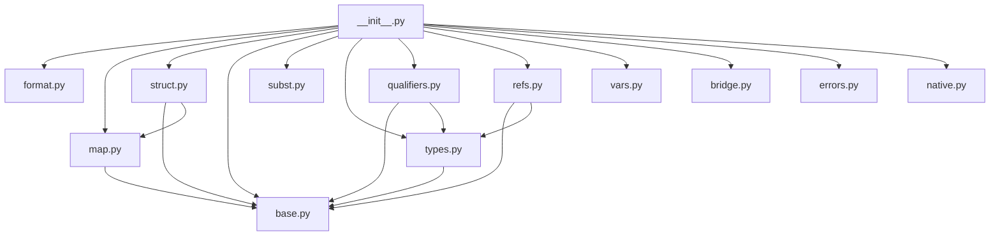

## Protomorph

Protomorph is organized around a small immutable core plus a singleton native registry.

### Design decisions

- `protomorph.__init__` is the public API surface and the bootstrap entry point.
- Bootstrap is sequential and explicit: all package imports happen first, then bootstrap initializes the remaining runtime globals.
- Host/native mappings live in `NativeRegistry` and use `protobase.flux` for cache invalidation.
- `NativeRegistry.native_types` is the single source of truth for host-type to protomorph-type mappings.
- Package-level globals are kept to a minimum. New globals should only exist when they are part of the public API or required by bootstrap.
- `pm._ANCHOR_TYPE` is initialized during bootstrap and acts as the shared root `AnchorType` instance.

### Formal model

- Protomorph works in a single universe of data.
- Types are not a separate universe; they are data that satisfy stronger structural constraints.
- Every runtime value carries two aligned trees:
  - `.data`: the payload tree
  - `.type`: the classifier tree
- The formal primitive is `schema`, not `type_of`.

Definitions:

```text
Sx := schema(x)

S(..I: x[I]) = (..I: S(x[I]))
```

- `(..)` is the structural particle of the model.
- Structural values are therefore closed under `schema`.
- Nominal structures do not replace structure; they identify and parameterize structural schemas.

Core semantic forms:

```text
schema(Anchor(path)) = (
    path: Text
)

schema(Spec(anchor, args)) = (
    anchor: schema(anchor),
    args: schema(args)
)

schema(Nominal(spec_ref)) = (
    spec_ref: schema(spec_ref)
)

schema(Qual.Nominal(spec_ref, underlying)) = (
    spec_ref: schema(spec_ref),
    underlying: schema(underlying)
)
```

Implementation correspondence:

- `schema(x)` is realized operationally through `type_of(x)` and `layout(type_of(x))`.
- `Type` is the runtime carrier between a value and its schema.
- `_metaspec()` must carry schema parameters, never raw specialization payloads.
- `StructType._metaspec()` is already close to this model.
- `SpecType._metaspec()`, `NominalType._metaspec()`, and `NominalQualifier._metaspec()` must be kept aligned with `schema(args)` rather than raw `args` instances.
- Empty specializations are normalized as structural emptiness, not `None`:
  - raw empty structure: `Struct.Empty`
  - empty args type: `EMPTY_STRUCT_TYPE`
  - typed empty structure value: `EmptyStruct`

### Imports and dependency policy

- A dependency is direct when a module needs another module in global scope during import.
- Type hints do not count as direct dependencies.
- Internal type hints use `import protomorph as pm` and `pm.*` names.
- Prefer explicit first-order imports when a symbol is needed in global scope.
- Prefer the package root (`pm.*`) for cross-module type hints and for high-level runtime coordination.
- Avoid introducing parallel state or shadow registries in helper modules.

### Global state policy

- Avoid new mutable globals unless they are true runtime singletons or bootstrap state.
- Do not duplicate registry-backed data in package globals.
- If runtime state already exists in `NativeRegistry`, use it instead of mirroring it elsewhere.
- Keep compatibility globals only when they have real users.

### Flux policy

- Use `flux.property` for primary registry state derived from mutable singleton storage.
- Use `flux.method` for cached queries over that state.
- Mutations must invalidate the relevant flux property explicitly.
- Avoid ad-hoc caches when the value belongs to the registry model.

### Direct dependency graph



### Runtime model

- Every `Val` is represented by aligned `.data` and `.type` trees.
- `type.construct(...)` is the Python-friendly construction route.
- `type.decode(raw)` is the canonical typed deserializer.
- `type.serialize(data)` is the type-level serializer.
- `value.encode()` is the public value serializer.
- `type.layout()` exposes semantic structure.

Layout kinds:

- `AtomicLayout(valid_types=...)` validates scalar-like raw host values.
- `StructLayout(fields=..., builtin_cls=...)` describes structured values and optional host materialization.

### Notes for contributors

- `__init__.py` is intentionally heavy because it owns orchestration and public exports.
- `native.py`, `bridge.py`, `subst.py`, and `format.py` operate at a higher layer and often coordinate through `pm.*`.
- When simplifying the design, prefer removing state and special cases over adding indirection.
